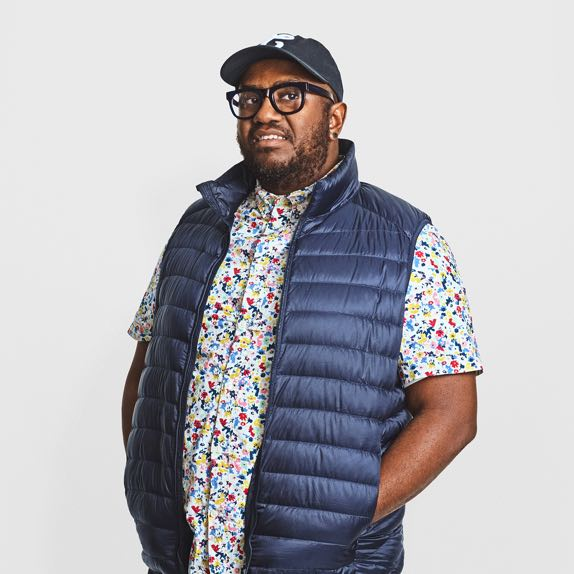
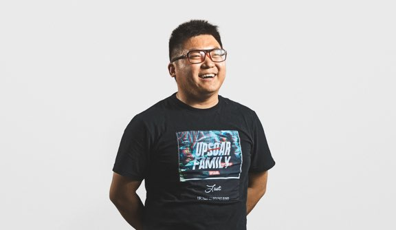
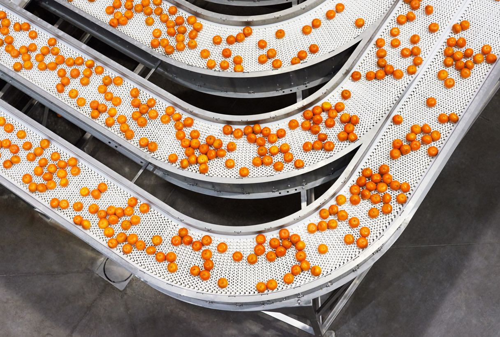
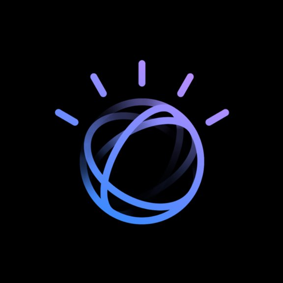
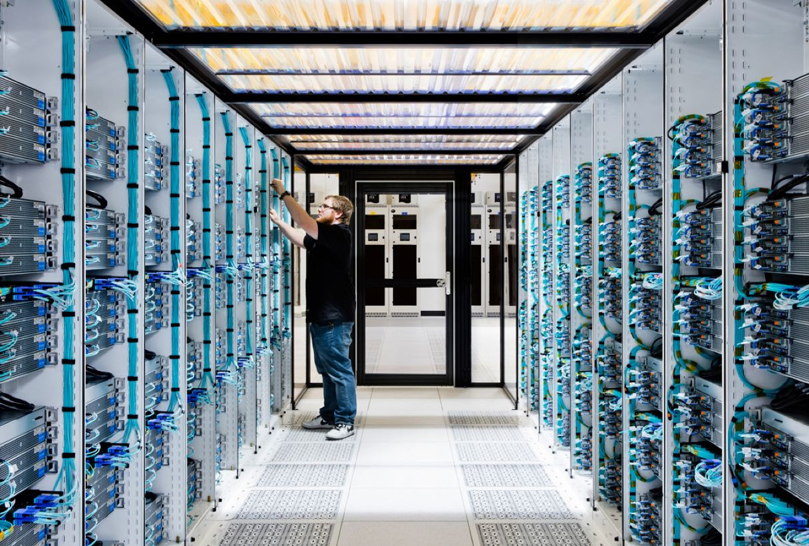
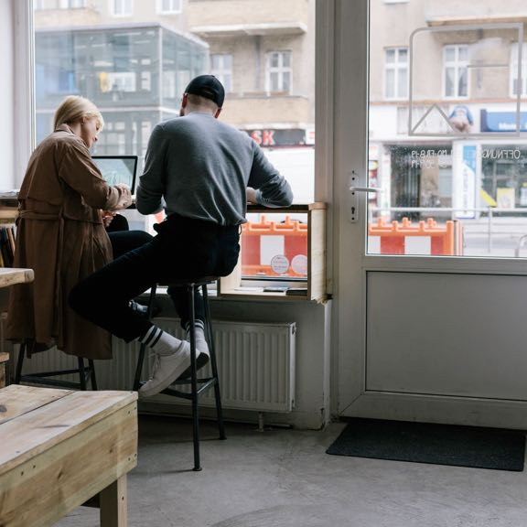
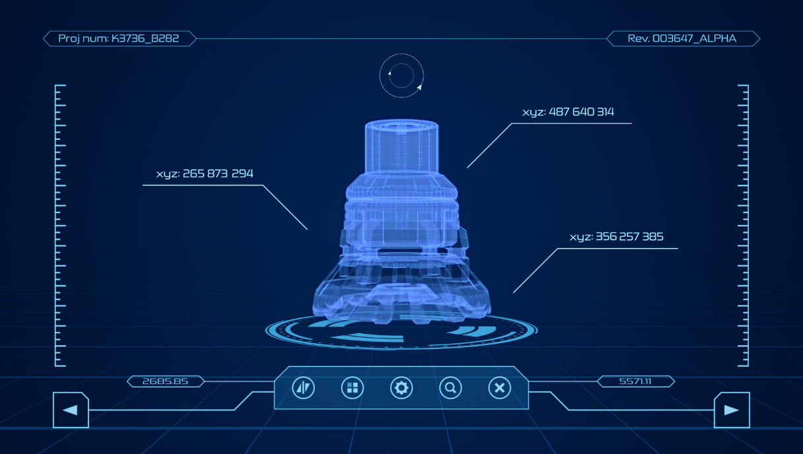
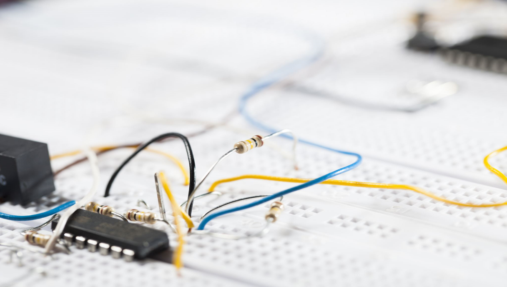
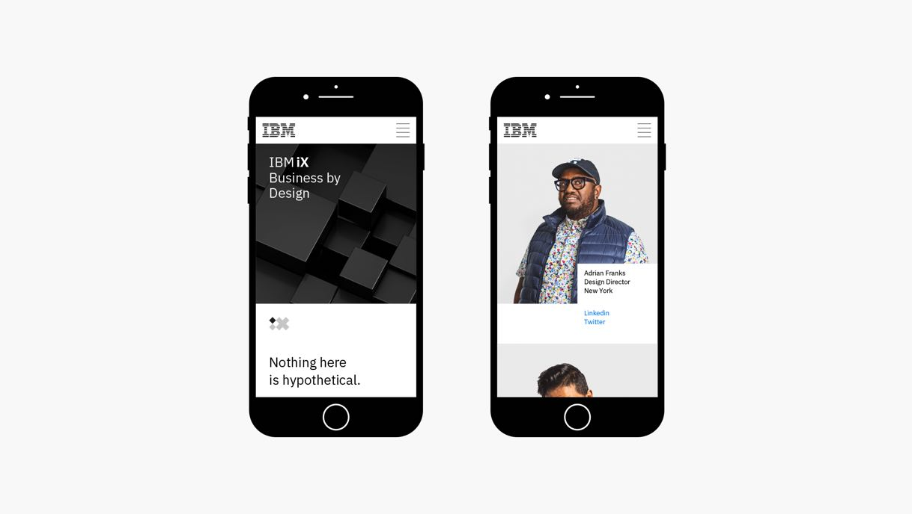
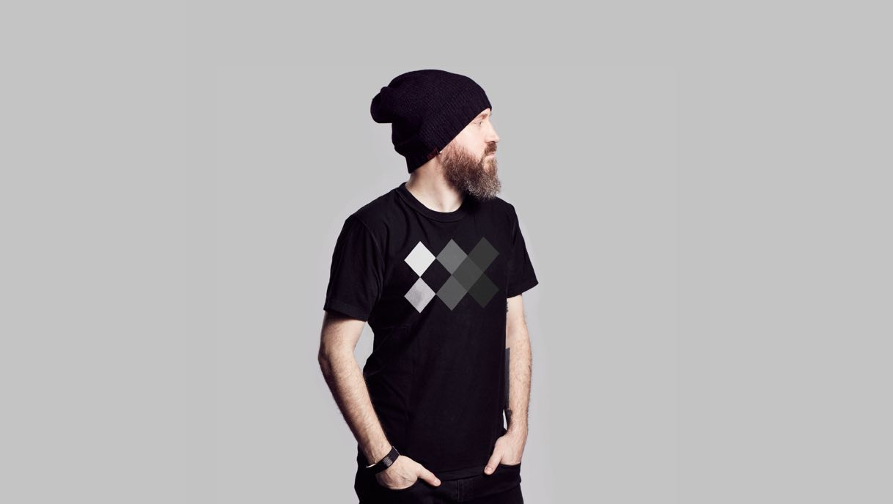

<title-block>

A solution’s quality hinges directly on 
the qualities of the team delivering it.

<anchor-links>

<ul>
<li><a data-scroll href="#about-us">About Us</a></li>
<li><a data-scroll href="#the-vision">The Vision</a></li>
<li><a data-scroll href="#our-team">Our Team</a></li>
<li><a data-scroll href="#join-our-team">Join Our Team</a></li>
</ul>

</anchor-links>

</title-block>

<grid background="gray-10">
<column lg="8" md="5">

The foundational unit of design is the
team. Learn how we leverage diversity
to strengthen our teams and deliver meaningful outcomes.

<icon name="PlexArrowDown"></icon>

</column>
</grid>
<grid background="gray-10">
<column lg="16">

</column>
<column lg="4" md="5">

### About Us

</column>
<column lg="8" md="5">

## Complex, multi-faceted challenges demand diverse, multi-talented teams.

When tackling complex problems at scale, we rely on the strength of diverse multidisciplinary teams to envision and execute on solutions that generate value for both our users and our clients.

Diversity comes in many forms: your job role, your educational history, your cultural background—all are important, and all are crucial to a team’s ability to deliver robust, differentiated outcomes.

</column>
<column lg="8" offset_lg="4" md="5" fade="true">

</column>
<column lg="4" md="3" fade="true">

</column>

</column>
<column lg="4" offset_lg="4" md="3" fade="true">

</column>
<column lg="8" md="5" fade="true">

</column>
</grid>
<grid background="gray-10">
<column lg="12" offset_lg="4">

## The dimensions of diversity

</column>
<column lg="4" offset_lg="4" border="true" md="5">

### Identity

Age and ability  
Gender identity  
Race and ethnicity

</column>
<column lg="4" border="true" md="5">

### Experience

Cultural upbringing  
Geography  
Language

</column>
<column lg="4" border="true" md="5">

### Expertise

Education  
Organization  
Discipline

</column>
</grid>
<grid background="gray-10">
<column lg="4">

### The Vision

</column>
<column lg="8" md="5">

## Good design requires a deep understanding of the business domain that's being designed for.

Rather than siloing designers into a single organization, we distribute them throughout teams and business units across IBM.

Embedding designers directly into the business allows them to build a rigorous understanding of the domain they’re working in. This knowledge, in turn, helps them align and collaborate more effectively with developers, engineers, product managers, and all of the other disciplines that must come together to deliver a great outcome.

</column>
<column lg="8" offset_lg="4" md="5" fade="true">

</column>
<column lg="4" md="3" fade="true">

</column>

</column>
<column lg="4" offset_lg="4" md="3" fade="true">

</column>
<column lg="8" md="5" fade="true">

</column>
</grid>
<grid background="gray-10">
<column lg="4">

### Our Team

</column>
<column lg="8" md="5">

## When users are intimately involved in the design process, you’re all but guaranteed to create something they love.

Human-centered design goes far beyond just speaking with a few people before you get started; it’s about truly co-creating with your business users and stakeholders by bringing them into the design process from Day 1.

From the initial visioning stages through to delivery and beyond, we work closely with both of these groups to ensure that every decision we make is rooted in a deep understanding of their goals and needs.

</column>
<column lg="8" offset_lg="4" md="5" fade="true">

</column>
<column lg="4" md="3" fade="true">

</column>

</column>
<column lg="4" offset_lg="4" md="3" fade="true">

</column>
<column lg="8" md="5" fade="true">

</column>
</grid>
<grid background="gray-100">
<column lg="7" md="5">

## Join our team

Ready to be part of Xtressials?  We’re always looking for talented, ambitious individuals to join us in our mission to bring about sustainability.

</column>

<column offset_lg="5" lg="4">

<anchor-links>

<ul>
<li><a data-scroll href="#software-development">Software Development</a></li>
<li><a data-scroll href="#hardware-development">Hardware Development</a></li>
<li><a data-scroll href="#community-support">Community Support</a></li>
</ul>

</anchor-links>

</column>
</grid>
<grid background="gray-100">
<column lg="16">

</column>
<column lg="4">

### Software Development

</column>
<column lg="8" md="5">

## Are you passionate about developing software for a sustainable future?

<a href="https://xtressials.typeform.com" target="_blank">Join Us <icon color="blue" name="ArrowUpRight20" inline="true"></icon></a>
 

</column>
<column lg="8" offset_lg="4" md="5">

<carousel id="c1" count="1 2 3 4">
  
  
  
  
</carousel>

</column>
<column lg="3"  md="3"  md="3" sm="0">

> __

> _***Shriti Chandra***   Development & Operations Head, XtressHealth_

</column>
</grid>
<grid background="gray-100">
<column lg="16">

</column>
<column lg="4">

### Hardware Development

</column>
<column lg="8" md="5">

## Do you get excited by the idea of tinkering around hardware stuff?

<a href="https://xtressials.typeform.com" target="_blank">Join Us <icon color="blue" name="ArrowUpRight20" inline="true"></icon></a>
 

</column>
<column lg="8" offset_lg="4" md="5">

<carousel id="c2" count="1 2 3 4">
  
  
  
  
</carousel>

</column>
<column lg="3" md="3" sm="0">

> __

> _***Pranav Prabhu***   Hardware Design Lead, Cloudiotics_

</column>
</grid>
<grid background="gray-100">
<column lg="16">

</column>
<column lg="4">

### Community Support

</column>
<column lg="8" md="5">

## Are you empathatic with a strong passion for community collaboration?

<a href="https://xtressials.typeform.com" target="_blank">Join Us <icon color="blue" name="ArrowUpRight20" inline="true"></icon></a>
 

</column>
<column lg="8" offset_lg="4" md="5">

<carousel id="c3" count="1 2 3 4">
  
  
  
  
</carousel>

</column>
<column lg="3" md="3" sm="0">

> __

> _***Vishesh Ghorawat***   Co-Founder, XtressVue_

</column>
</grid>
