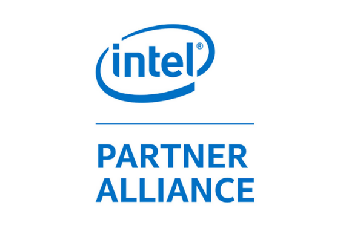
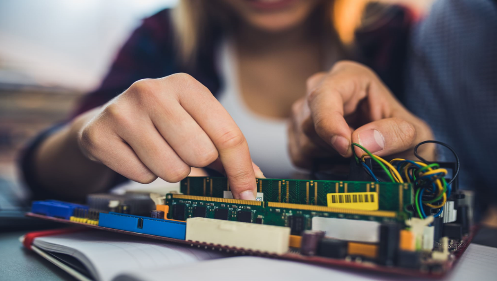

<title-block>

Make it simple. Make it memorable. 
Make it inviting to use. Make it fun to ease.

<anchor-links>

<ul>
<li><a data-scroll href="#about-us">About Us</a></li>
<li><a data-scroll href="#the-vision">The Vision</a></li>
<li><a data-scroll href="#our-partners-and-supporters">Our Partners</a></li>
<li><a data-scroll href="#join-our-team">Join Our Team</a></li>
</ul>

</anchor-links>

</title-block>

<grid background="gray-10">
<column lg="8" md="5">

The foundational unit of innovation is the
team. Learn how we leverage our skills
to create and deliver meaningful outcomes.

<icon name="PlexArrowDown"></icon>

</column>
</grid>
<grid background="gray-10">
<column lg="16">

</column>
<column lg="4" md="5">

### About Us

</column>
<column lg="8" md="5">

## Xtressials was founded as a student initiative to develop projects aiming at solving real-world problems.

We gathered a cloud credit funding worth USD12000 from a major cloud provider and started tackling complex problems at scale, while extending his projects and relying on the strength of his diverse multidisciplinary teams to envision and execute on solutions that generates the required value.

</column>
<column lg="8" offset_lg="4" md="5" fade="true">

</column>
<column lg="4" md="3" fade="true">

</column>

</column>
<column lg="4" offset_lg="4" md="3" fade="true">

</column>
<column lg="8" md="5" fade="true">

</column>
</grid>
<grid background="gray-10">
<column lg="12" offset_lg="4">

## The pillars of foundation at Xtressials

</column>
<column lg="4" offset_lg="4" border="true" md="5">

### Aim For Sustainability

</column>
<column lg="4" border="true" md="5">

### Enjoy The Process

</column>
<column lg="4" border="true" md="5">

### Excecute Decentralization

</column>
</grid>
<grid background="gray-10">
<column lg="4">

### The Vision

</column>
<column lg="8" md="5">

## .

From the initial visioning stages through to development and beyond, we aim at sustainable outcomes to ensure that every decision we make is rooted and aligns with our goals and project's need.

</column>
<column lg="8" offset_lg="4" md="5" fade="true">

</column>
<column lg="4" md="3" fade="true">

</column>

</column>
<column lg="4" offset_lg="4" md="3" fade="true">

</column>
<column lg="8" md="5" fade="true">

</column>
</grid>
<grid background="gray-10">
<column lg="4">

### Our Partners and Supporters

</column>
<column lg="8" md="5">

## .

</column>
<column lg="4" offset_lg="4" md="3" fade="true">

<tile title_size="small" title="Member: Samsung Smart Things Developer" href="#">
    
  </tile>

</column>
<column lg="4" md="3" fade="true">

<tile title_size="small" title="Member: Intel®️ Partner Alliance" href="#">
    
  </tile>

</column>
</grid>

<grid background="gray-100">
<column lg="7" md="5">

## Join our team

Ready to be part of Xtressials?  We’re always looking for talented, ambitious individuals to join us in our mission to bring about sustainability.

</column>

<column offset_lg="5" lg="4">

<anchor-links>

<ul>
<li><a data-scroll href="#software-development">Software Development</a></li>
<li><a data-scroll href="#hardware-development">Hardware Development</a></li>
<li><a data-scroll href="#community-support">Community Support</a></li>
</ul>

</anchor-links>

</column>
</grid>
<grid background="gray-100">
<column lg="16">

</column>
<column lg="4">

### Software Development

</column>
<column lg="8" md="5">

## Are you passionate about developing software for a sustainable future?

<a href="https://xtressials.typeform.com" target="_blank">Join Us <icon color="blue" name="ArrowUpRight20" inline="true"></icon></a>
 

</column>
<column lg="8" offset_lg="4" md="5">

<carousel id="c1" count="1 2 3 4">
  
  
  
  
</carousel>

</column>
<column lg="3"  md="3"  md="3" sm="0">

> __

> _***Shriti Chandra***   Development & Operations Head, XtressHealth_

</column>
</grid>
<grid background="gray-100">
<column lg="16">

</column>
<column lg="4">

### Hardware Development

</column>
<column lg="8" md="5">

## Do you get excited by the idea of tinkering around hardware stuff?

<a href="https://xtressials.typeform.com" target="_blank">Join Us <icon color="blue" name="ArrowUpRight20" inline="true"></icon></a>
 

</column>
<column lg="8" offset_lg="4" md="5">

<carousel id="c2" count="1 2 3 4">
  
  
  
  
</carousel>

</column>
<column lg="3" md="3" sm="0">

> __

> _***Pranav Prabhu***   Hardware Design Lead, Cloudiotics_

</column>
</grid>
<grid background="gray-100">
<column lg="16">

</column>
<column lg="4">

### Community Support

</column>
<column lg="8" md="5">

## Are you empathatic with a strong passion for community collaboration?

<a href="https://xtressials.typeform.com" target="_blank">Join Us <icon color="blue" name="ArrowUpRight20" inline="true"></icon></a>
 

</column>
<column lg="8" offset_lg="4" md="5">

<carousel id="c3" count="1 2 3 4">
  
  
  
  
</carousel>

</column>
<column lg="3" md="3" sm="0">

> __

> _***Vishesh Ghorawat***   Co-Founder, XtressVue_

</column>
</grid>
