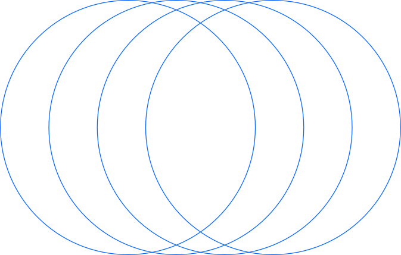
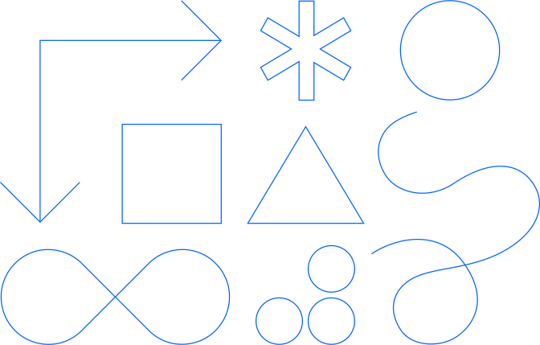
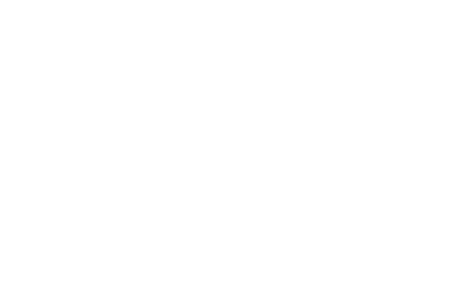

<title-block>

The key to 
Sustainability
is to focus on the
 human problems.

<anchor-links>

<ul>
<li><a data-scroll href="#sustainability">Sustainability</a></li>
<li><a data-scroll href="#enjoy-the-process">Enjoy The Process</a></li>
<li><a data-scroll href="#decentralization">Decentralization</a></li>
</ul>

</anchor-links>

</title-block>

<grid background="gray-10">
<column lg="8"  md="5">

## People are at center of everything we do and every problem we solve. Problem solving is just the means. Sustainable outcomes are the goal.

<icon name="PlexArrowDown"></icon>

</column>

</grid>

<tile
    feature="true"
    feature_style="alt"
    feature_heading="Sustainability"
    feature_heading_secondary="The beliefs behind everything we do"
    feature_background="black"
    feature_description="True innovation is about giving people a path, both emotionally and functionally, towards sustainability."
    href="#"
    title="Learn more">

</tile>
<tile
    feature="true"
    feature_style="alt"
    feature_heading="Enjoy The Process"
    feature_heading_secondary="Human-centered experience at scale"
    feature_background="magenta-20"
    feature_description="Learn how we tends to enjoy our journey to pave way to a sustainable future."
    href="#"
    title="Learn more">

</tile>
<tile
    feature="true"
    feature_style="alt"
    feature_heading="Decentralization"
    feature_heading_secondary="The methodology that expands and scale"
    feature_background="gray-80"
    feature_description="At Xtressials, we imagine the solutions of the future, with the capacity to scale."
    href="#"
    title="Learn more">

</tile>
