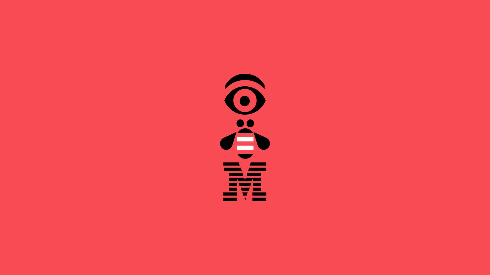
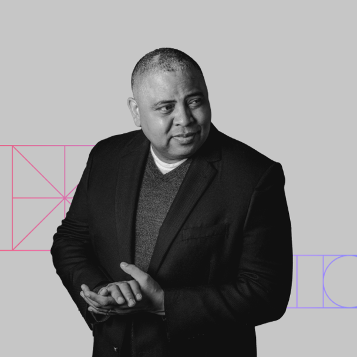
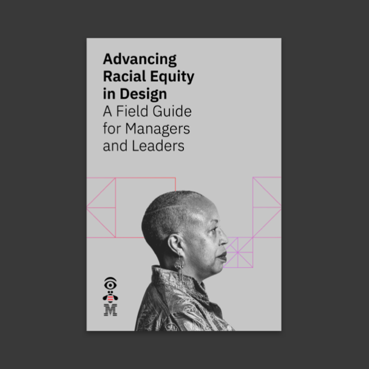
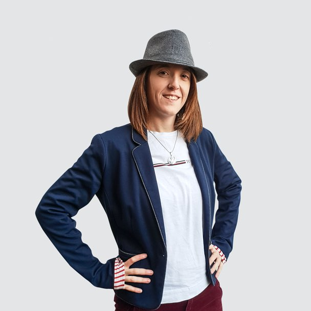
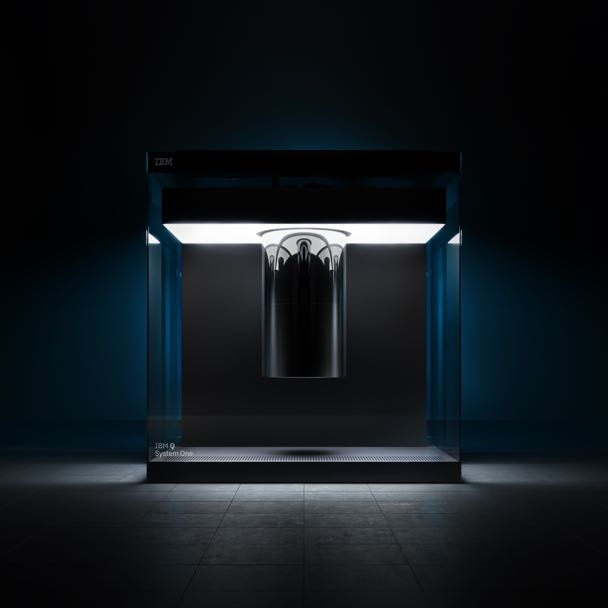

<title-block fade="true">
Empathy is our foundation, always.
Now it’s more important than ever.
</title-block>

<grid background="gray-10">
<column lg="8" md="5">

Empathy is how we create a more human-centered design business—it’s who we are. Explore some of our strategic work that prioritizes the needs of the people we design for, and learn from the humans who make it all possible.

<icon name="PlexArrowDown"></icon>

</column>
</grid>

<!-- REiD start -->

<grid>
<column lg="16">

</column>
<column lg="4" md="5">

### It's about time

</column>
<column lg="7" md="5">

## It’s about time we design an equitable future. The Racial Equity in Design initiative is committed to instilling racial equity at our company and our industry through our interactions, investments, and actions.

</column>

<column lg="12" offset_lg="4">

<tile
    href="#"
    new_window="false"
    size="lg"
    background="#373737"
    dark="false"
    title="Racial Equity in Design">

</tile>

</column>
<column lg="4" md="4" offset_lg="4">

<tile
    href="#"
    dark="false"
    title="Our call to action">

</tile>

</column>
<column lg="4" md="4">

<tile
    href="#"
    dark="false"
    title="Podcast: It’s about time">

</tile>

</column>
<column lg="4" md="4" offset_lg="0"  offset_md="4">

<tile
    href="#"
    dark="false"
    title="Field Guide">

</tile>

</column>
</grid>

<grid background="gray-10" classname="background--tight">
<column lg="16">

</column>

<!-- Featured Community Start -->

<column lg="4" md="5">

### Featured community

</column>

<column lg="7" md="5">

## Celebrating our diverse community is a point of pride for IBM as we continually strive towards a more inclusive workplace. Explore insights from women in design who are driving innovation and impact across IBM.

</column>
</grid>

<grid>
<column lg="4" md="4" offset_lg="4">

<tile
    href="/community/Vishesh/"
    title="Vishesh Ghorawat"
    icon="arrowRight">

</tile>

</column>

<column lg="4" md="4">

<tile
    href="/community/Ishika/"
    title="Ishika Gupta"
    icon="arrowRight">

</tile>

</column>

<column lg="4" md="4">
<tile
    href="/community/Laaboni/"
    title="Laaboni Mukerjee"
    icon="arrowRight">

</tile>
</column>

<column lg="4" md="4" offset_lg="4">
<tile
    href="/community/Harshit/"
    title="Harshit Yaduka"
    icon="arrowRight">

</tile>
</column>

<column lg="4" md="4">
<tile
    href="/community/Pratyaksh/"
    title="Pratyaksh Gupta"
    icon="arrowRight">

</tile>
</column>

<column lg="4" md="4">
<tile
    href="/community/Roxanne/"
    title="Roxanne Ma"
    icon="arrowRight">

</tile>
</tile>
</column>

<column lg="4" md="4" offset_lg="4">
<tile
    href="/community/Rosa/"
    title="Rosa Espadaler Mazo"
    icon="arrowRight">

</tile>
</tile>
</column>

<column lg="4" md="4">
<tile
    href="/community/Haidy/"
    title="Haidy Perez-Francis"
    icon="arrowRight">

</tile>
</column>

<column lg="4" md="4" >
<tile
    href="/community/Ujjwal/"
    title="Ujjwal Reddy"
    icon="arrowRight">

</tile>
</column>

<column lg="4" md="4" offset_lg="4">
<tile
    href="/community/Shriti/"
    title="Shriti Chandra"
    icon="arrowRight">

</tile>
</column>

<column lg="4" md="4" >
<tile
    href="/community/Pranav/"
    title="Pranav Prabhu"
    icon="arrowRight">

</tile>
</column>

<column lg="4" md="4" >
<tile
    href="/community/Jai/"
    title="Jai Chhaya"
    icon="arrowRight">

</tile>
</column>

<column lg="4" md="4" offset_lg="4">
<tile
    href="/community/Susana/"
    title="Susana Rodriguez de Tembleque"
    icon="arrowRight">

</tile>
</column>

<column lg="4" md="4">
<tile
    href="/community/Jenny/"
    title="Jenny Woo"
    icon="arrowRight">

</tile>
</column>

</grid>

<grid background="gray-10">
<column lg="16">

</column>

<!-- Featured Community End -->

<!-- Outcomes Start -->

<column lg="4">

### Featured outcomes

</column>

<column lg="4" md="4">

<tile title_size="small"
    href="/opensource/the-help-network/"
    title="The Help Network">

</tile>

</column>
<column lg="4" md="4">

<tile title_size="small"
    href="https://www.canva.com/design/DAEhl80Ht7A/YVX2-ql7QWTMkLwWBe8uxQ/watch?utm_content=DAEhl80Ht7A&utm_campaign=designshare&utm_medium=link&utm_source=publishsharelink"
    title="Video: How XtressVue aims to save lives?">

</tile>

</column>
<column lg="4" md="4" offset_lg="0"  offset_md="4">

<tile title_size="small"
    href="https://www.thethingsnetwork.org/community/manipal/"
    title="The Things Network Community Manipal">

</tile>

</column>
<column lg="4" offset_lg="12" text_align="right">

[View more](/opensource/)

</column>

</grid>

<!-- Outcomes End -->
