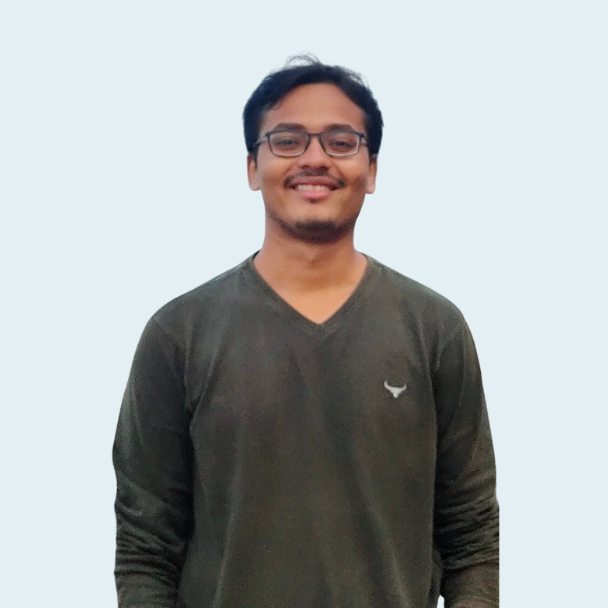

<title-block fade="true">
Building  India's First P2P
Disaster Resilience   Network.
</title-block>

<grid background="gray-10">
<column lg="8" md="5">

Explore some of our work that prioritizes the needs of the people we innovate for, and learn from them who makes it all possible.

<icon name="PlexArrowDown"></icon>

</column>
</grid>

<!-- REiD start -->

<grid>
<column lg="16">

</column>
<column lg="4" md="5">

### It's about being empathatic

</column>
<column lg="7" md="5">

## It’s about being empathatic towards creating an equitable and sustainable future...

</column>

<column lg="12" offset_lg="4">

<tile
    href="#"
    new_window="false"
    size="lg"
    background="#373737"
    dark="false"
    title="Empathy in Innovation">

</tile>

</column>
<column lg="4" md="4" offset_lg="4">

<tile
    href="#"
    dark="false"
    title="Our call to Sustainability">

</tile>

</column>
<column lg="4" md="4">

<tile
    href="https://enjoytheprocess.substack.com/"
    dark="false"
    title="Enjoy The Process">

</tile>

</column>
<column lg="4" md="4" offset_lg="0"  offset_md="4">

<tile
    href="#"
    dark="false"
    title="Decentralization is the Future">

</tile>

</column>
</grid>

<grid background="gray-10" classname="background--tight">
<column lg="16">

</column>

<!-- Featured Community Start 

<column lg="4" md="5">

### Featured community members

</column>

<column lg="7" md="5">

## Great things in business are never done by one person,They are done by a team of people.
> ***-Steve Jobs***

</column>
</grid>

<grid>
<column lg="4" md="4" offset_lg="4">

<tile
    href="https://www.linkedin.com/in/akashagarwal4/"
    title="Akash Agarwal"
    icon="arrowRight">

</tile>

</column>

<column lg="4" md="4">

<tile
    href="https://www.linkedin.com/in/harshit-yaduka-454a701b1/"
    title="Harshit Yaduka"
    icon="arrowRight">

</tile>

</column>

<column lg="4" md="4">
<tile
    href="https://www.linkedin.com/in/ishika-g-8653a3135/"
    title="Ishika Gupta"
    icon="arrowRight">

</tile>

</column>

<column lg="4" md="4" offset_lg="4">
<tile
    href="#"
    title="Jai Chhaya"
    icon="arrowRight">

</tile>

</column>

<column lg="4" md="4">
<tile
    href="https://www.linkedin.com/in/laaboni-mukerjee-16b34b188/"
    title="Laaboni Mukerjee"
    icon="arrowRight">

</tile>

</column>

<column lg="4" md="4" >
<tile
    href="https://www.linkedin.com/in/prnvprbh/"
    title="Pranav Prabhu"
    icon="arrowRight">

</tile>
</column>

<column lg="4" md="4" offset_lg="4">
<tile
    href="https://www.linkedin.com/in/oscillator25/"
    title="Pratyaksh Gupta"
    icon="arrowRight">

</tile>

</column>

<column lg="4" md="4">
<tile
    href="https://www.linkedin.com/in/shritichandra/"
    title="Shriti Chandra"
    icon="arrowRight">

</tile>

</column>

<column lg="4" md="4">
<tile
    href="https://www.linkedin.com/in/vishesh-ghorawat-a0382b1b1/"
    title="Vishesh Ghorawat"
    icon="arrowRight">

</tile>

</column>

</grid>

<grid background="gray-10">
<column lg="16">

</column>

<!-- Featured Community End -->

<!-- Outcomes Start -->

<column lg="4">

### Featured outcomes

</column>

<column lg="4" md="4">

<tile title_size="small"
    href="/opensource/the-help-network/"
    title="The Help Network">

</tile>

</column>
<column lg="4" md="4">

<tile title_size="small"
    href="https://www.canva.com/design/DAEhl80Ht7A/YVX2-ql7QWTMkLwWBe8uxQ/watch?utm_content=DAEhl80Ht7A&utm_campaign=designshare&utm_medium=link&utm_source=publishsharelink"
    title="Video: How XtressVue aims to save lives?">

</tile>

</column>
<column lg="4" md="4" offset_lg="0"  offset_md="4">

<tile title_size="small"
    href="https://www.thethingsnetwork.org/community/manipal/"
    title="The Things Network Community Manipal">

</tile>

</column>
<column lg="4" offset_lg="12" text_align="right">

[View more](/opensource/)

</column>

</grid>

<!-- Outcomes End -->

