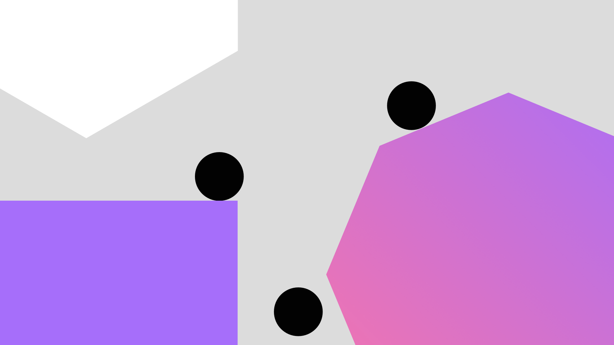
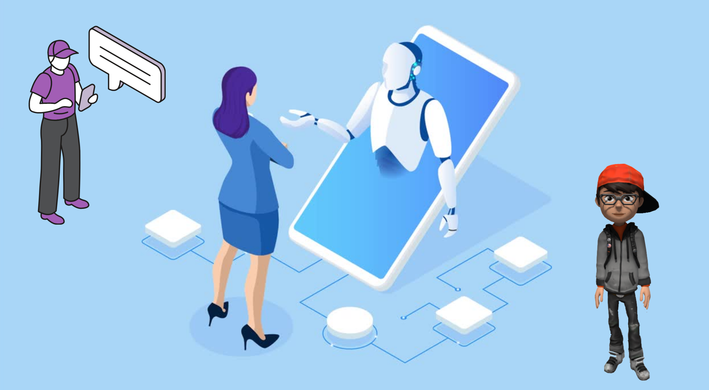
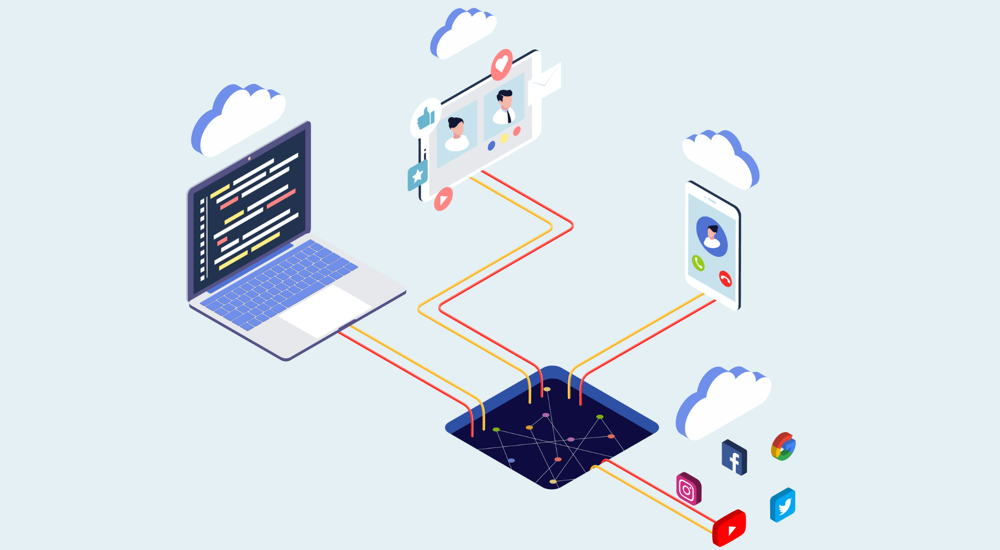
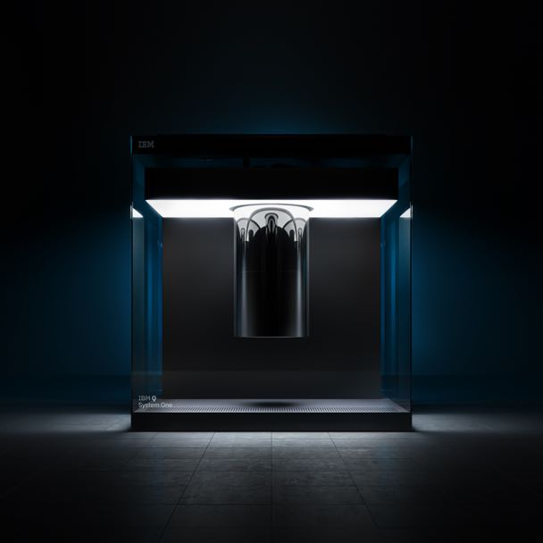
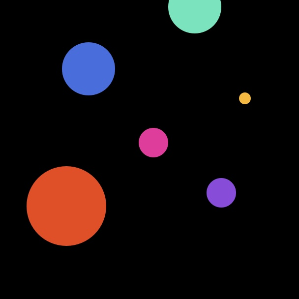
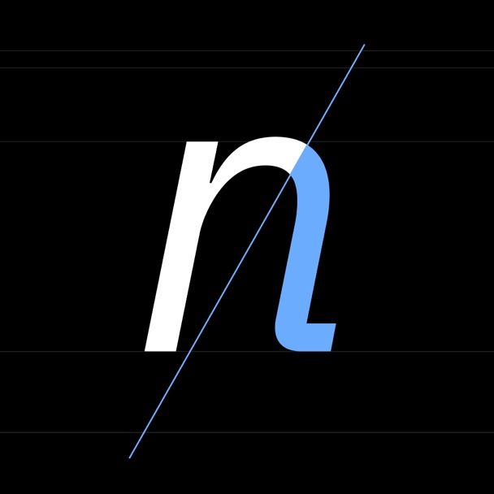
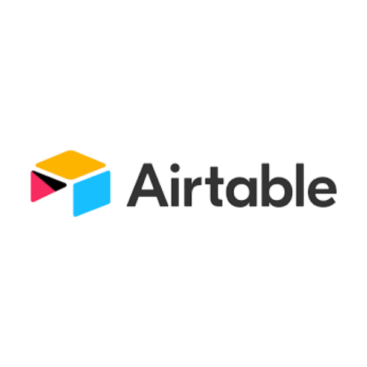

<title-block>
Design is simply 
the means. 
Business outcomes
 are the goal.
</title-block>

<grid background="gray-10">
<column lg="8" md="5">

In a world where every challenge is complex and unique, good design values unity over uniformity. Explore some of the different outcomes we’ve delivered for our clients and users below.

<icon name="PlexArrowDown"></icon>

</column>
</grid>

<grid background="gray-10">
<column lg="16">

</column>
<column lg="4">

### The Help NEtwork

</column>

<column lg="12">

<tile title_size="small" icon="arrowRight" title="Facilitates collaboration among people in managing the supply and demand of goods to be distributed to the needy." href="/opensource/the-help-network">

  </tile>

</column>

</grid>

<grid background="gray-10">
<column lg="16">

</column>
<column lg="4">

### XtressHub

</column>

<column lg="12">

<tile title_size="small" title="Avid community of student developers with an aspiration to support the development of revolutionizing projects in their pursuit to learn and explore different technical domains of their interests." href="#">

  </tile>

</column>

</grid>

<grid background="gray-10">
<column lg="16">

</column>
<column lg="4">

### XtressBot

</column>

<column lg="12">

  <tile title_size="small" title="Aims to create a universal architecture which integrates bots addressing different specific domains or topics and allows extended integration to different services." href="$">
    

  </tile>

</column>

</grid>
<grid background="gray-10">
<column lg="16">

</column>
<column lg="4">

### The Things Network Community Manipal

</column>

<column lg="12">

  <tile title_size="small" icon="arrowRight" title="Our mission is to provide the entire Manipal with Internet of Things data connectivity by crowdsourcing the network by its citizens and local companies." href="/opensource/things-community-manipal/">
    

  </tile>

</column>

</grid>
<grid background="gray-10">
<column lg="16">

</column>
<column lg="4" md="8">

### Project Partners

</column>

<column lg="4"  md="4">
  <tile title_size="small" title="Gallery" href="/impact/quantum/">
    
  </tile>

</column>
</grid>
<grid background="gray-10">
<column lg="16">

</column>
<column lg="4" md="8">

### Community Partners

</column>

<column lg="4" md="4">
  <tile title_size="small" title="Gallery" href="/opensource/security/">
    
  </tile>

</column>
<column lg="4" md="4">

  <tile title_size="small" title="IEEE Student Branch Manipal" href="https://ieeemanipal.com/">
    
  </tile>

</column>
</grid>

<grid background="gray-10">
<column lg="16">

</column>
<column lg="4" md="8">

### Our Supporters

</column>

<column lg="4" md="4">
  <tile title_size="small" title="Gallery" href="/opensource/plex/">
    
  </tile>

</column>
<column lg="4" md="4">

  <tile title_size="small" title="GitBook" href="https://www.gitbook.com/">
    
  </tile>

</column>
<column lg="4" md="4" offset_lg="0"  offset_md="4">

  <tile title_size="small" title="Airtable" href="https://airtable.com/">
    
  </tile>

</column>
</grid>
