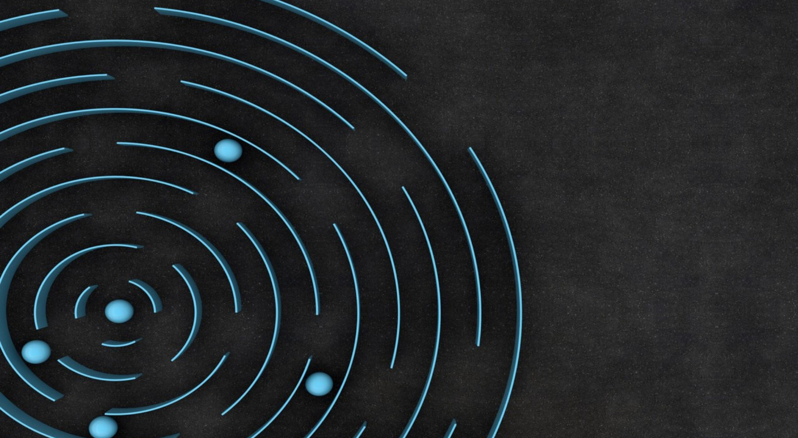
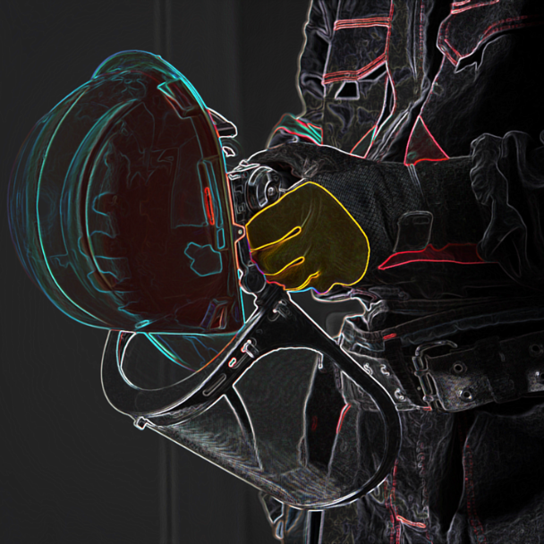
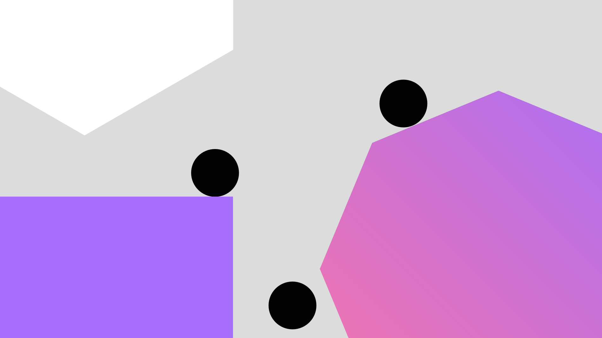
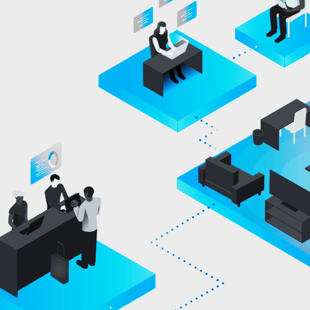
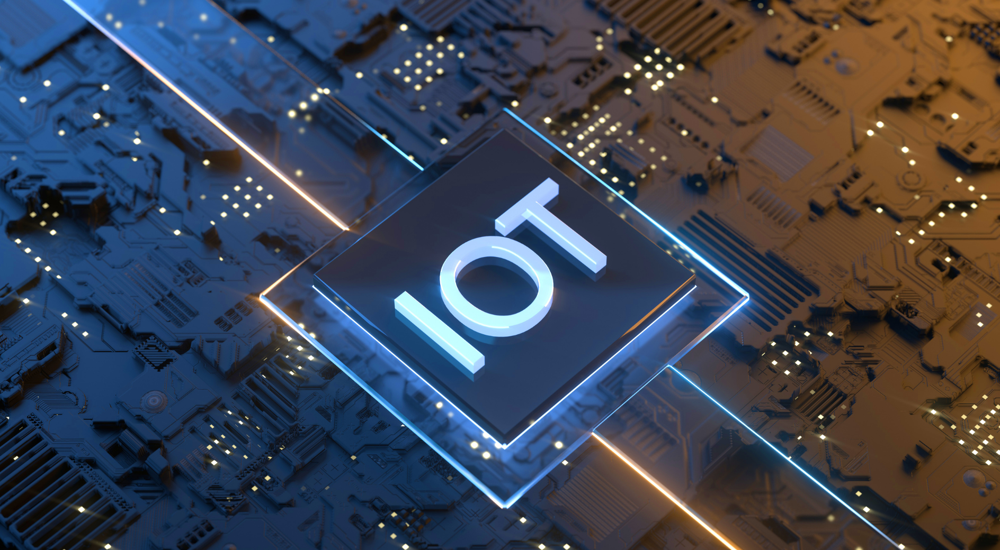

<title-block>
The best problems 
to work on are often  
the ones nobody else 
even tries to solve.

<anchor-links>

<ul>
<li><a data-scroll href="#emphasizing-sustainability">Emphasizing Sustainability</a></li>
<li><a data-scroll href="#promoting-collaboration">Promoting Collaboration</a></li>
<li><a data-scroll href="#innovating-the-future">Innovating the Future</a></li>  
<li><a data-scroll href="#enhancing-iot-accessibility">Enhancing IoT Accesibility</a></li>  
<li><a data-scroll href="#revolutionizing-healthcare">Revolutionizing HealthCare</a></li>
</ul>

</anchor-links>

</title-block>

<grid background="gray-100">
<column lg="8" md="5">

Explore the growing plethora of projects and solutions designed to innovate the present and sustain the future.

<icon name="PlexArrowDown" color="white"></icon>

</column>
</grid>
<grid background="gray-100">
<column lg="16">

</column>
<column lg="4" md="5">

### Emphasizing Sustainability

</column>
<column lg="7" md="5">

## We care and develop for sustainability and well-being.

</column>

<column lg="12" offset_lg="4">

<tile
    href="#"
    new_window="false"
    size="lg"
    background="#373737"
    dark="true"
    title="XtressVue">

</tile>

</column>
<column lg="4" md="4" offset_lg="4">

<tile
    href=""
    dark="true"
    title="Xtressials Safety, Security & Surveillance Retrofit">

</tile>

</column>
</grid>
<grid background="gray-100">
<column lg="16">

</column>
<column lg="4">

### Promoting Collaboration

</column>
<column lg="7" md="5">

## Collaboration that combines trust, accountability, and transparency among the community.

</column>
<column lg="12" offset_lg="4">

<tile
    href="#"
    size="lg"
    background="#C5DEFF"
    dark="true"
    title="The Help Network">

</tile>
<tile
    href="#"
    size="lg"
    background="#C5DEFF"
    dark="true"
    title="XtressHub">

</tile>

</column>
</grid>
<grid background="gray-100">
<column lg="16">

</column>
<column lg="4" md="5">

### Innovating the Future

</column>
<column lg="7" md="5">

## We design human-centric innovative solutions for those in need.

</column>

<column lg="12" offset_lg="4">

<tile
    href="#"
    new_window="false"
    size="lg"
    background="#373737"
    dark="true"
    title="Agri.Tech">

</tile>

</column>
<column lg="4" md="4" offset_lg="4">

<tile
    href="#"
    dark="true"
    title="XtressWAN">

</tile>

</column>
<column lg="4" md="4">

<tile
    href="#"
    dark="true"
    title="XtressChain">

</tile>

</column>
<column lg="4" md="4" offset_lg="0"  offset_md="4">

<tile
    href="#"
    dark="true"
    title="XtressBot">

</tile>

</column>
</grid>
<grid background="gray-100">
<column lg="16">

</column>
<column lg="4">

### Enhancing IoT Accessibility

</column>
<column lg="7" md="5">

## IoT Platform crafted by Xtressials accessibility team to help you deliver accessible IoT solutions to the market.

</column>
<column lg="12" offset_lg="4">

<tile
    href="#"
    new_window="false"
    size="lg"
    background="#F2BDD8"
    dark="true"
    title="Cloudiotics">

</tile>

</column>

<grid background="gray-100">
<column lg="16">

</column>
<column lg="4">

### Revolutionizing Healthcare

</column>
<column lg="7" md="5">

## We aim towards developing a stress-free, cost effective, simple to use vital monitoring system for the elderly.

</column>
<column lg="12" offset_lg="4">

<tile
    href="#"
    new_window="false"
    size="lg"
    background="#F2BDD8"
    dark="true"
    title="XtressHealth">

</tile>

</column>
</grid>
