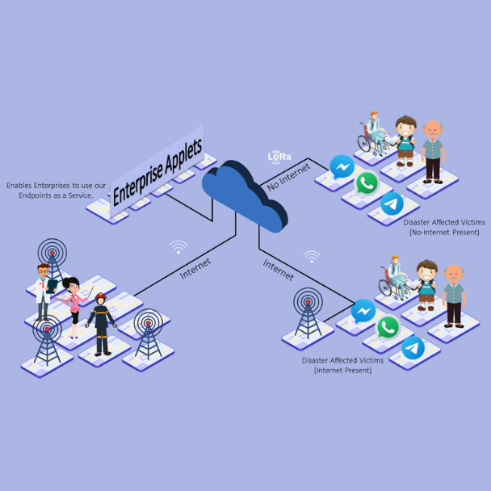
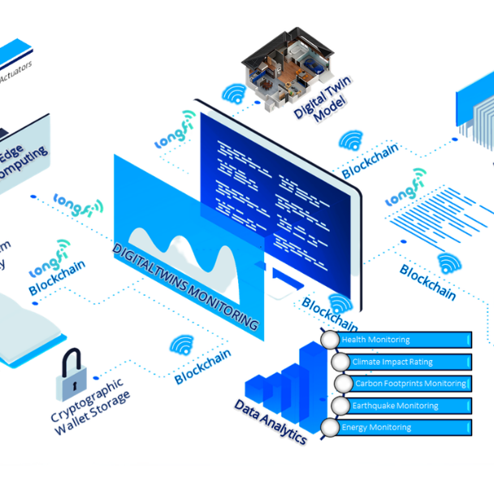

<title-block>

The strongest 
bonds are formed 
when aesthetic 
meets pragmatic.

<anchor-links>

<ul>
<li><a data-scroll href="#emphasizing-sustainability">Emphasizing Sustainability</a></li>
<li><a data-scroll href="#promoting-collaboration">Promoting Collaboration</a></li>
<li><a data-scroll href="#innovating-the-future">Innovating the Future</a></li>  
<li><a data-scroll href="#enhancing-iot-accessibility">Enhancing IoT Accesibility</a></li>  
<li><a data-scroll href="#revolutionizing-healthcare">Revolutionizing HealthCare</a></li>
</ul>

</anchor-links>

</title-block>

<grid background="gray-100">
<column lg="8" md="5">

Tap into a growing collection of design tools, assets, and resources to keep your business moving forward.

<icon name="PlexArrowDown" color="white"></icon>

</column>
</grid>
<grid background="gray-100">
<column lg="16">

</column>
<column lg="4" md="5">

### Emphasizing Sustainability

</column>
<column lg="7" md="5">

## Principles, guidelines, and ready-made assets to help you build exceptional experiences.

</column>

<column lg="12" offset_lg="4">

<tile
    href="#"
    new_window="false"
    size="lg"
    background="#373737"
    dark="true"
    title="XtressVue">

</tile>

</column>
<column lg="4" md="4" offset_lg="4">

<tile
    href=""
    dark="true"
    title="XtressCare">

</tile>

</column>
<column lg="4" md="4">

<tile
    href=""
    dark="true"
    title="Xtressials Safety, Security & Surveillance Retrofit">

</tile>

</column>
<column lg="4" md="4" offset_lg="0"  offset_md="4">

<tile
    href=""
    dark="true"
    title="XtressTwins">

</tile>

</column>
</grid>
<grid background="gray-100">
<column lg="16">

</column>
<column lg="4">

### Promoting Collaboration

</column>
<column lg="7" md="5">

## A scalable learning approach that combines online learning with in-person activation to make design thinking stick.

</column>
<column lg="12" offset_lg="4">

<tile
    href="#"
    size="lg"
    background="#C5DEFF"
    dark="true"
    title="The Help Network">

</tile>
<tile
    href="#"
    size="lg"
    background="#C5DEFF"
    dark="true"
    title="XtressHub">

</tile>

</column>
</grid>
<grid background="gray-100">
<column lg="16">

</column>
<column lg="4" md="5">

### Innovating the Future

</column>
<column lg="7" md="5">

## A collection of guidelines, resources, and ethics to give you what you need to design human-centric AI solutions.

</column>

<column lg="12" offset_lg="4">

<tile
    href="#"
    new_window="false"
    size="lg"
    background="#373737"
    dark="true"
    title="Agri.Tech">

</tile>

</column>
<column lg="4" md="4" offset_lg="4">

<tile
    href="#"
    dark="true"
    title="XtressWAN">

</tile>

</column>
<column lg="4" md="4">

<tile
    href="#"
    dark="true"
    title="XtressChain">

</tile>

</column>
<column lg="4" md="4" offset_lg="0"  offset_md="4">

<tile
    href="#"
    dark="true"
    title="XtressBot">

</tile>

</column>
</grid>
<grid background="gray-100">
<column lg="16">

</column>
<column lg="4">

### Enhancing IoT Accessibility

</column>
<column lg="7" md="5">

## Resources and guidance crafted by IBM’s accessibility experts to help any product team deliver an accessible solution to the market.

</column>
<column lg="12" offset_lg="4">

<tile
    href="#"
    new_window="false"
    size="lg"
    background="#F2BDD8"
    dark="true"
    title="Cloudiotics">

</tile>

</column>

<grid background="gray-100">
<column lg="16">

</column>
<column lg="4">

### Revolutionizing Healthcare

</column>
<column lg="7" md="5">

## Providing Stress-Free Health Monitoring For Elderly. Resources and guidance crafted by IBM’s accessibility experts to help any product team deliver an accessible solution to the market.

</column>
<column lg="12" offset_lg="4">

<tile
    href="#"
    new_window="false"
    size="lg"
    background="#F2BDD8"
    dark="true"
    title="XtressHealth">

</tile>

</column>
</grid>
